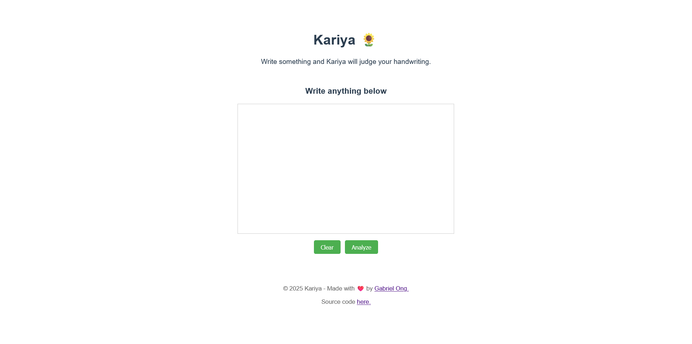
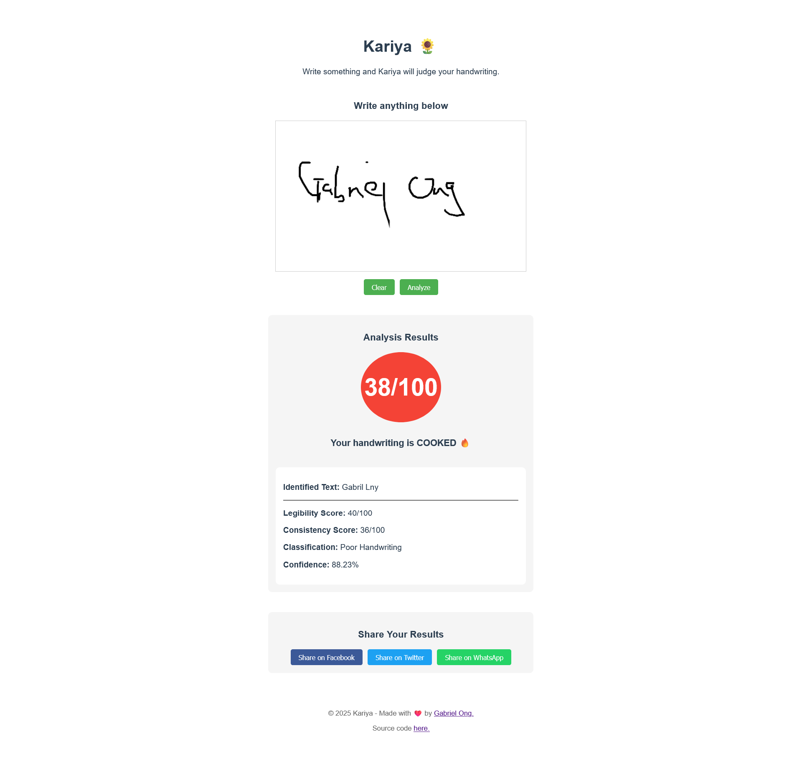
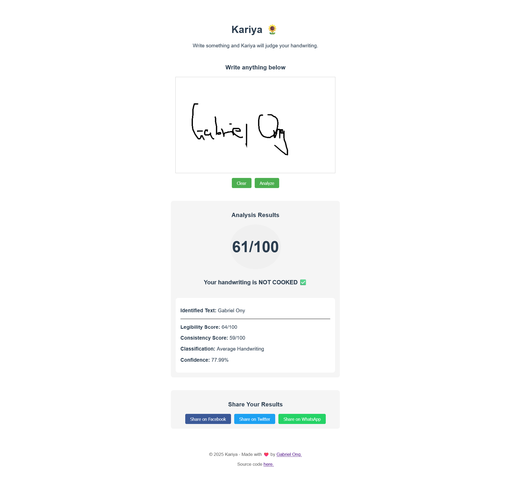
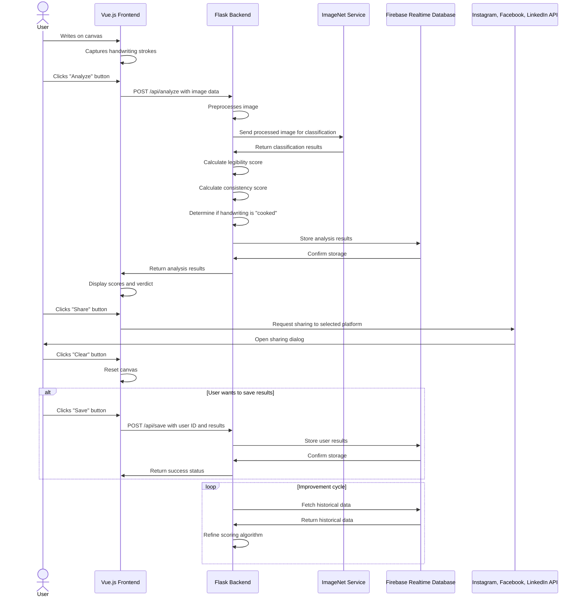
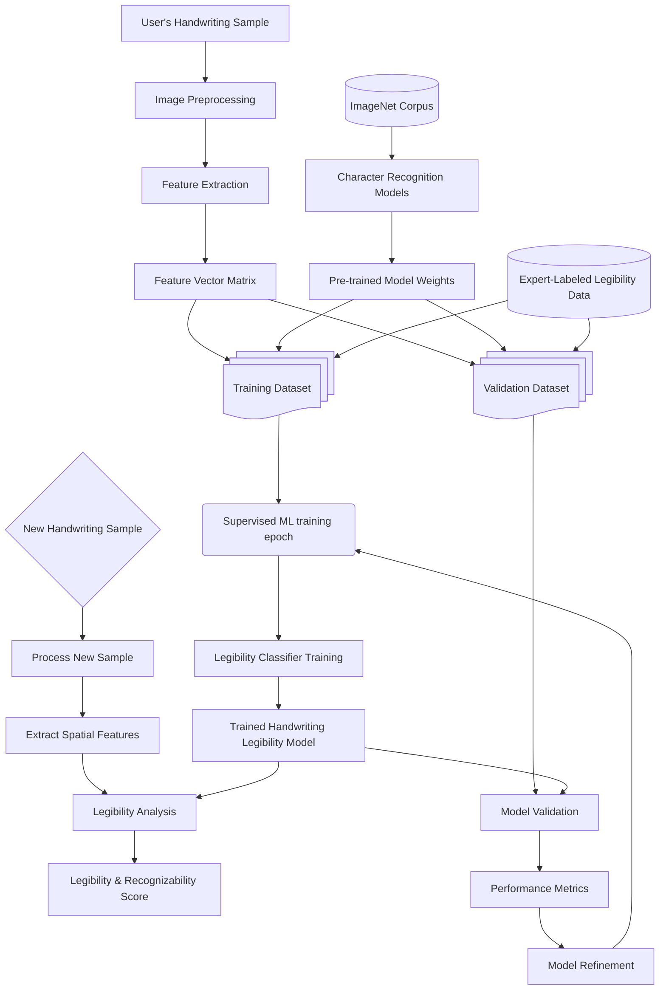

[](https://github.com/gongahkia/kariya/releases/tag/1.0.0)

# `Kariya` 🌻

Tiny Web App that analyses and [scores](#screenshot) the legibility of your handwriting.

`Kariya` is trained on the [ImageNet](https://www.image-net.org/) database.

<div align="center">
  
</div>

## Stack

* Frontend *(Vue.js, Tailwind CSS, Netlify)*
* Backend *(Flask)*
* DB *(Firebase Realtime Database)*
* Training and Validation Corpus *(ImageNet)*

## Screenshot

<div style="display: flex; justify-content: space-between;">
  
  
</div>

## Usage

```console
$ git clone https://github.com/gongahkia/kariya
$ cd kariya/kariya-app
$ npm install
$ cd ../backend
$ python3 -m venv myenv
$ source myenv/bin/activate
$ pip install -r requirements.txt
$ cd ..
$ python3 main.py
```

## Architecture

### Overview



### Database

```json
{
  "users": {
    "$userId": {
      "name": "String",
      "email": "String",
      "profile_picture": "String",
      "analyses": {
        "$analysisId": {
          "timestamp": "Timestamp",
          "imageUrl": "String",
          "legibilityScore": "Number",
          "consistencyScore": "Number",
          "totalScore": "Number",
          "isCooked": "Boolean",
          "classification": "String",
          "confidence": "Number",
          "characterRecognition": {
            "$character": "Number"
          },
          "feedback": "String"
        }
      }
    }
  },
  "analyses": {
    "$analysisId": {
      "userId": "String",
      "timestamp": "Timestamp",
      "imageUrl": "String",
      "legibilityScore": "Number",
      "consistencyScore": "Number",
      "totalScore": "Number",
      "isCooked": "Boolean",
      "classification": "String",
      "strokes": [
        {
          "points": [
            {
              "x": "Number",
              "y": "Number",
              "time": "Number"
            }
          ],
          "pressure": "Number"
        }
      ],
      "trainingContribution": "Boolean"
    }
  },
  "modelVersions": {
    "$versionId": {
      "releaseDate": "Timestamp",
      "accuracy": "Number",
      "precision": "Number",
      "recall": "Number",
      "f1Score": "Number",
      "trainingSamples": "Number",
      "active": "Boolean"
    }
  }
}
```

### Backend



## Reference

The name `Kariya` is in reference to [Kariya Kagetoki](https://champloo.fandom.com/wiki/Kariya_Kagetoki) *(better known as the "Hand of God")*, an elite samurai working for the Shogunate. He first makes an appearance in the episode, [Evanescent Encounter Part 1](https://champloo.fandom.com/wiki/Evanescent_Encounter_(Part_1)) of the anime [Samurai Champloo](https://champloo.fandom.com/wiki/Samurai_Champloo_Wiki).

